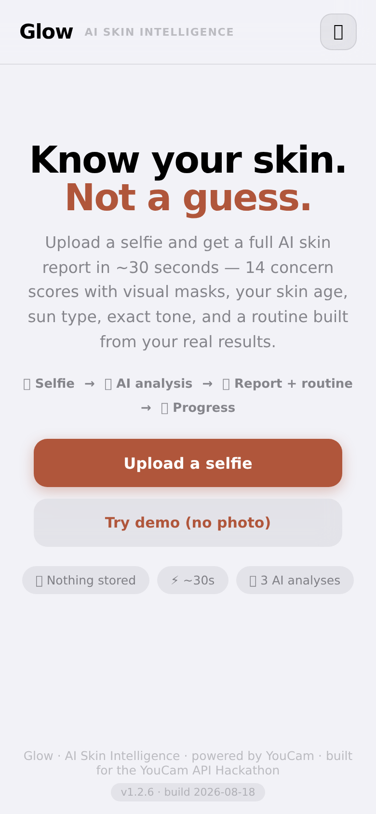
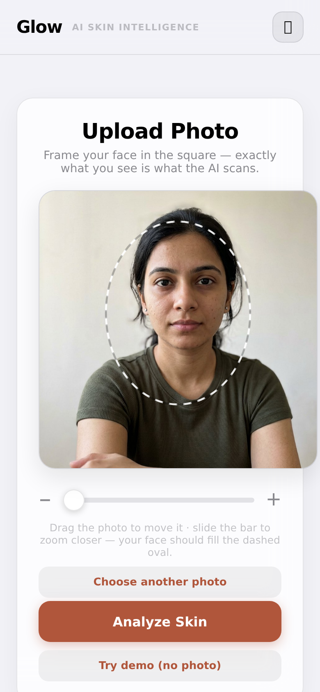
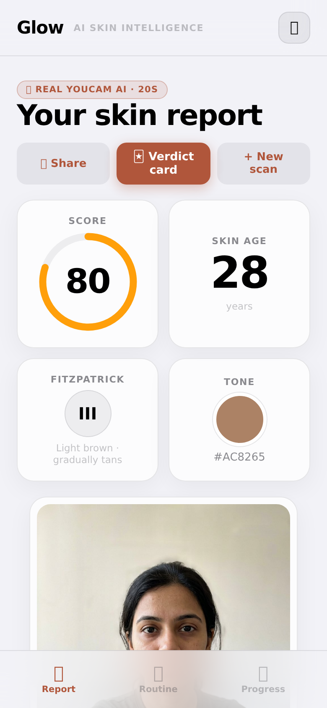
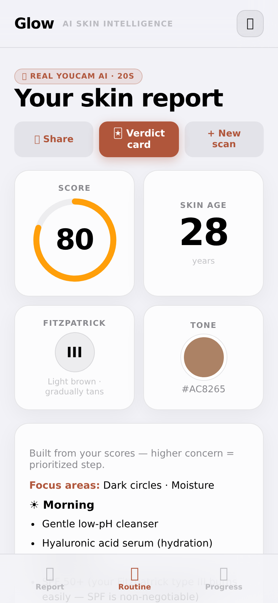

# Glow — AI Skin Intelligence

**Upload a selfie → get a dermatologist-grade skin report in ~30 seconds — 14 concern scores with visual detection masks, skin age, Fitzpatrick sun type, exact tone — plus a routine built from *your* numbers, and proof of whether your numbers can even be trusted.**

Built for the **YouCam API Skin AI & Apparel VTO Hackathon** (topic: **Skin AI**) on three orchestrated YouCam APIs.

## Live demo

**https://yashwanth07-debug.github.io/glow-skin/**
Runs in **demo mode** with zero setup (no API key needed — judges can click *«Try demo (no photo)»* and see the full experience in 3 seconds). With a YouCam API key configured it runs **real live analysis** on every scan.

## 🎥 Demo video (1:42)

**https://youtu.be/SZwuhVDO1AU** — a single real take on the live app: real YouCam scan, self-correcting pipeline, report + masks, routine, honest progress, and the 3× re-scan uncertainty verdicts.

| Landing | Capture (crop + zoom) | Report | Routine |
|---|---|---|---|
|  |  |  |  |

More: [all screenshots](docs/screenshots/) — analyzing state, concern-region view, progress, share card, dark mode, desktop.

## The problem (consumer & retail value)

Skincare is a ~$150B industry running on guesswork. Shoppers buy products that don't match their skin, can't tell if anything works, and have no access to professional analysis (cost, time, embarrassment). **Glow turns any phone camera into an honest skin analyst**: measure → understand → act → re-measure. That *scan → recommend → re-scan* loop is exactly the repeat-engagement engine that the 800+ brands on Perfect Corp's platform monetize — Glow demonstrates it end-to-end in a single self-contained web app.

## Why this is not an API wrapper

Four non-trivial systems sit between the user and the API:

1. **Self-correcting capture pipeline.** A drag+zoom crop editor shows the *exact* square the AI receives. Behind it, a window × zoom-ladder search tries the user's crop first, then auto face-zone candidates, shrinking the window (`1× → 0.6× → 0.42× → 0.3×`) whenever the API reports the face is too small, and bailing on photo-inherent errors. Skin-tone/Fitzpatrick failures self-recover too: widened context crops, other windows, and a **roll-correction ladder** (`±8°/±15°`) that counter-rotates tilted photos client-side — head tilt is the #1 angle error, so most «photo angle» skips never reach the user. Result: the classic *«face too small / no face / face angle»* failure classes practically disappear, and retries cost **zero units** (YouCam only charges successful tasks).
2. **Adaptive low-latency polling.** Task polling starts at 600 ms and backs off ×1.35 (2.2 s cap) instead of a naive fixed 3 s interval — typically seconds faster *per scan* without hammering the API.
3. **Rule-based routine engine** (`src/lib/routine.ts`, unit-tested): deterministic, inspectable mapping of actual scores → actives (e.g. low moisture → hyaluronic; wrinkles → retinol timing rules that never conflict with BHA nights), AM/PM/weekly plans, Fitzpatrick-aware SPF advice, color-season palette from measured tone hexes.
4. **Uncertainty engine** (`src/lib/verdict.ts`): re-scans the same face 3× and computes per-metric spread, labeling each metric *trustworthy / borderline / noise / saturated* — because one AI score is a number, and honest measurement is the product. Nobody else in this space tells you when *not* to trust the AI.

## YouCam APIs used

| YouCam API | What Glow uses it for | ≈ units/successful task |
|---|---|---|
| **AI Skin Analysis** (`skin-analysis`) | 14 concerns → scores + detection masks, overall score, skin age | 16 |
| **AI Facial Color Tones** (`skin-tone-analysis`) | skin/eye/lip/brow/hair hexes → color profile + season analysis | 20 |
| **AI Fitzpatrick Skin Type** (`fitzpatrick-scale-analyzer`) | type I–VI → sunscreen/UV guidance | 10 |

Browser-direct REST calls (file-slot → S3 upload → task → adaptive poll), three analyses launched in parallel per crop. A full scan costs ≈ **46 units**; failed/framing-retry tasks are free.

## Features

- 📸 Guided capture: drag 1:1 + zoom bar (1–6×) + dashed face oval — *what you see is what the AI scans*
- 🧬 Live report: animated score ring, skin age, Fitzpatrick card with UV note, tone dot + hex, 14 color-coded concern tiles
- 🗺 Detection masks overlaid on your actual selfie per concern (tap a tile) — demo mode shows an illustrated region map
- 🧴 Personalized AM/PM/weekly routine + focus areas + honest disclaimer
- 📈 Local history & progress (no account, `localStorage`), trend chart over **real scans only** (demo data is labelled and never charted), per-metric uncertainty verdicts (3× re-scan)
- 🃏 Persona “verdict card” + screenshot-ready share card (Web Share API / clipboard)
- ⚡ Honest loading: staged checklist driven by the real pipeline (never a fake progress bar) + live elapsed timer; dismissible, actionable errors that keep your photo
- 🌙 Dark mode, mobile-first (360 px+), accessible (ARIA, focus rings, `prefers-reduced-motion`)
- 🎬 Zero-key demo mode with labeled sample data — the demo can never fail live

## Quickstart

```bash
npm ci
npm run dev          # local demo mode, no key needed
```

Real analysis: set `VITE_YOUCAM_KEY` (get a key at the [YouCam API console](https://yce.perfectcorp.com/ai-api)):

```bash
echo "VITE_YOUCAM_KEY=sk-..." > .env
npm run dev
```

Deploy (this repo is ready for GitHub Pages): push to `main` and the workflow in `.github/workflows/pages.yml` runs tests, builds with the `VITE_YOUCAM_KEY` repo secret, and deploys. No key in code, ever — see `.env.example`.

```bash
npm test             # 30 unit tests (crop/window math, error mapping, routine, verdict, store)
npm run build        # type-check + production build
```

## Architecture

```
src/
  App.tsx            UI state machine (landing → capture → analyzing → report)
  lib/youcam.ts      YouCam client: upload/tasks, adaptive polling, crop+zoom
                     ladder search, friendly error mapping (unit-tested)
  lib/routine.ts     Deterministic scores→routine rules engine (unit-tested)
  lib/verdict.ts     Uncertainty engine: re-scan variance → trust verdicts (unit-tested)
  lib/store.ts       Local scan history (provider-tagged; demo never charted)
  lib/demo.ts        Labeled demo data (provider: 'demo')
docs/                architecture · DB schema · screenshots
```

Privacy: photos are processed in-memory in the browser, sent only to YouCam for analysis, and nothing is stored server-side by Glow (history stays on-device).

## How this maps to the judging criteria

| Criterion | Where Glow answers it |
|---|---|
| **Technological Implementation** | 3 YouCam APIs orchestrated per scan (masks used visually, not just scores); non-trivial client systems: crop+zoom-ladder retry, roll-correction ladder, adaptive polling, rules + uncertainty engines, 30 unit tests, CI deploy |
| **Design** | Complete product: guided capture → animated report → routine → progress → share; dark mode; real screenshots above; error/empty/demo states all designed |
| **Potential Impact** | The skincare guesswork problem is quantified and the scan→recommend→re-scan loop maps directly onto how 800+ Perfect Corp brands retain customers |
| **Quality of the Idea** | Not "rate my face": honest measurement (uncertainty verdicts), contested-beauty-canons education in-app, routine generated from real scores, capture UX engineered to make scanning never fail |

## Submission kit

- 🎥 Demo video: https://youtu.be/SZwuhVDO1AU (1:42, real scan, voice-over)
- ✍️ [DEVPOST.md](DEVPOST.md) — the submitted Devpost text + demo-video script
- 📸 [docs/screenshots/](docs/screenshots/) — 10 up-to-date captures (mobile + desktop + dark mode)
- 📐 [docs/ARCHITECTURE.md](docs/ARCHITECTURE.md) · [docs/DATABASE.md](docs/DATABASE.md)

## License

[MIT](LICENSE)
